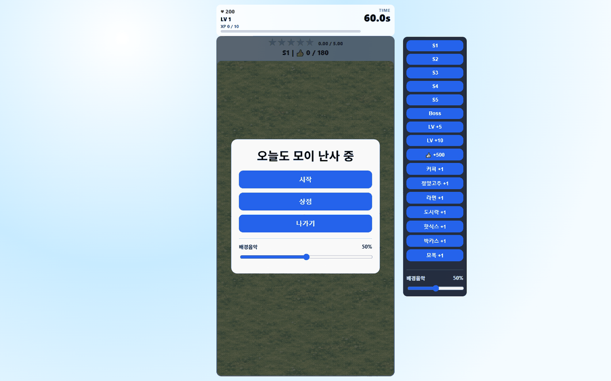
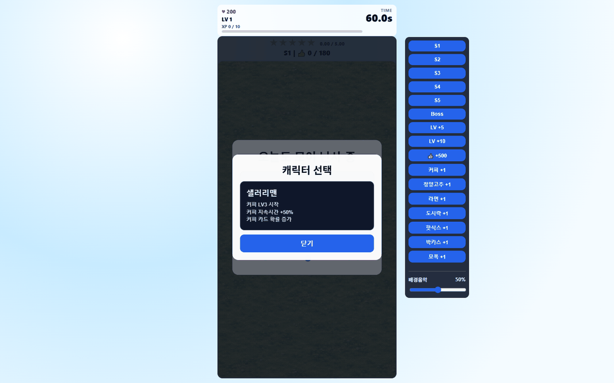

# Pigeon / 오늘도 모이 난사 중

> **TL;DR (EN):** A small browser-game prototype that turns Vampire Survivors-like growth into feeding pigeons.
> What worked: movement, food projectiles, pigeons, level/stat systems, and a browser-local loop.
> What still needs human judgment: translating combat numbers into feeding feel, reactions, and balance. (as of 2026-07, using Codex)

### 2026-07 시점 화면

나중에 같은 아이디어를 다시 만들면 이 섹션 아래에 재시도 화면을 추가해, 당시 AI 도구가 어디까지 달라졌는지 비교합니다.

## 무엇을 확인하려고 만들었는가

`pigeon`은 뱀파이어 서바이벌류 구조를 그대로 복제하려는 프로젝트가 아니라, 그 구조의 감정을 다른 방향으로 바꿀 수 있는지 확인한 웹게임 실험입니다.

기존 뱀서류는 적을 없애고, 공격 속도와 범위와 데미지를 키우는 쾌감이 중심입니다. 여기서는 그 대신 비둘기에게 모이를 던지고, 비둘기들이 몰려와 배부르게 먹는 느낌을 만들고 싶었습니다.

실행: [GitHub Pages](https://rep87.github.io/pigeon/)

## 실제로 작동한 것

- 기본 이동
- 모이 투사체
- 비둘기 등장
- 레벨과 스탯 구조
- 프로토타입용 상점/디버그성 조작
- 브라우저에서 빠르게 반복할 수 있는 게임 루프

이 실험에서 확인한 것은 AI가 익숙한 장르의 바깥 구조를 빠르게 만들 수 있다는 점입니다. 이동하고, 투사체가 나가고, 대상이 등장하고, 수치가 오르는 기본 틀은 짧은 시간 안에 구성할 수 있었습니다.

## 부족했던 것

(2026-07, Codex 기준) 문제는 구조가 아니라 감정의 번역이었습니다.

공격력, 공격 속도, 범위, 투사체 수 같은 숫자는 전투 게임에서는 자연스럽지만, 비둘기에게 모이를 주는 컨셉에서는 그대로 옮기기 어렵습니다. 먹이를 주는 쾌감은 포만감, 몰려드는 반응, 먹는 애니메이션, 풍성함, 소리와 피드백에서 나와야 하는데, 현재 버전은 아직 그 감각이 약합니다.

즉, 장르의 숫자 성장은 가져올 수 있었지만, 그것을 "먹이를 주는 기분"으로 바꾸는 설계는 별도의 문제였습니다.

## 재시도 시 비교할 포인트

- 전투 스탯 대신 포만감, 먹이 종류, 몰림, 반응 중심으로 성장 구조 재설계
- 비둘기가 먹이를 발견하고 반응하는 시각 피드백 강화
- 먹이를 많이 뿌렸을 때 화면이 풍성해지는 느낌 만들기
- 현재 2026-07 버전과 이후 AI coding agent / 이미지 생성 모델 기반 재시도 버전 비교

## 관련 기록

이 프로젝트는 [AI Game Prototyping Experiments](https://github.com/rep87/ai-game-prototyping-experiments)의 일부입니다.

이 레포는 2026-07-07에 `game_pigeon_3` 로컬 작업 버전을 기준으로 동기화했습니다. 비슷한 이름의 복사본 폴더는 로컬 아카이브로 취급합니다.
